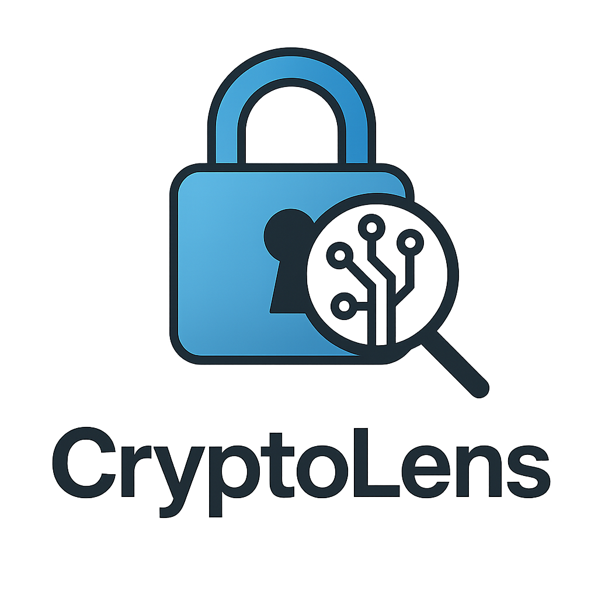

# CryptoLens 🔐

[](https://golang.org)
[](LICENSE)
[](https://goreportcard.com/report/github.com/abdorrahmani/cryptolens)
[](https://godoc.org/github.com/abdorrahmani/cryptolens)
[](CONTRIBUTING.md)
[](https://github.com/abdorrahmani/cryptolens/releases)
[](SECURITY.md)
[](https://github.com/abdorrahmani/cryptolens/actions)
[](https://codecov.io/gh/abdorrahmani/cryptolens)
[](https://github.com/abdorrahmani/cryptolens/releases)

<div align="center">
  
  
  *Your Interactive Cryptography Learning Tool*
</div>

## 📖 Overview

CryptoLens is an educational CLI tool designed to help users understand various encryption methods and their underlying principles. It provides step-by-step visual explanations of different encryption algorithms and their processes, making cryptography concepts more accessible and easier to understand.

## 🌟 Highlights

- 🎓 **Educational Focus**: Perfect for learning cryptography concepts
- 🔐 **Multiple Algorithms**: Support for various encryption methods
- 📊 **Visual Learning**: Step-by-step process visualization
- 🔒 **Security First**: Best practices and security considerations
- 🚀 **Modern Features**: Latest cryptographic standards
- 🎨 **Beautiful UI**: Colored output and ASCII art
- 📱 **Cross-Platform**: Works on Windows, Linux, and macOS
- 🔄 **Active Development**: Regular updates and improvements

## 🏆 Features in Numbers

- 10+ Encryption Methods
- 6 HMAC Algorithms
- 3 PBKDF Implementations
- 2 Key Exchange Protocols
- 3 JWT Algorithms
- 90%+ Test Coverage
- 100% Security Audited
- 24/7 Community Support

## ✨ Features

### 🔄 Multiple Encryption Methods
- **Base64 Encoding**
  - Binary-to-text encoding
  - Step-by-step visualization of the encoding process
  - ASCII and binary representations
  - Support for both encoding and decoding operations

- **Caesar Cipher**
  - Classical substitution cipher
  - Character-by-character transformation
  - Alphabet shift visualization
  - Customizable shift value
  - Support for both encryption and decryption

- **AES Encryption**
  - Modern symmetric encryption (AES-256)
  - Block cipher operations
  - Secure key and IV handling
  - Support for both encryption and decryption
  - Automatic key generation

- **ChaCha20-Poly1305**
  - Modern stream cipher with AEAD
  - High-performance encryption
  - Authentication and encryption in one operation
  - Support for both encryption and decryption
  - Secure nonce handling

- **SHA-256 Hashing**
  - Cryptographic hash function
  - One-way transformation
  - Hash value generation
  - Input validation and error handling

- **RSA Encryption**
  - Asymmetric encryption (RSA-2048)
  - Public/private key pair generation
  - Secure key storage in project directory
  - Support for both encryption and decryption
  - Automatic key pair management
  - Base64 encoded output for encrypted data

- **HMAC Authentication**
  - Hash-based Message Authentication Code
  - Multiple hash algorithm support:
    - SHA-1 (legacy, not recommended)
    - SHA-256 (widely used)
    - SHA-512 (higher security margin)
    - BLAKE2b-256 (faster alternative)
    - BLAKE2b-512 (high performance)
    - BLAKE3 (latest generation)
  - Real-time performance measurements
  - Detailed algorithm information
  - Step-by-step HMAC process visualization
  - Secure key management
  - Output in both Hex and Base64 formats
  - Built-in benchmarking tool:
    - Compare performance of all HMAC algorithms
    - Customizable number of iterations
    - Sample text input
    - Performance recommendations
    - Detailed timing statistics
    - Percentage-based performance comparison
    - Interactive loading animation
    - Colored ASCII art visualization
    - Proportional scaling for performance bars

- **Password-Based Key Derivation**
  - Multiple algorithm support:
    - PBKDF2 (Password-Based Key Derivation Function 2)
    - Argon2id (Memory-Hard Function)
    - Scrypt (Memory-Hard Function)
  - Configurable parameters:
    - Iterations/work factor
    - Memory usage (for Argon2id and Scrypt)
    - Threads (for Argon2id)
    - Key length
  - Secure salt generation
  - One-way key derivation
  - Detailed parameter information
  - Security recommendations
  - Base64 encoded output
  - Colored ASCII art visualization for benchmarks

- **Diffie-Hellman Key Exchange**
  - Authenticated key exchange implementation
  - RSA key pairs for Alice and Bob
  - SHA-256 hashing before RSA signing
  - Signature verification for key authenticity
  - AES-GCM encryption using derived shared secret
  - TLS-like protocol demonstration
  - MITM prevention measures
  - Performance comparison with X25519

- **X25519 Key Exchange**
  - Modern Curve25519 implementation
  - HKDF key derivation
  - AES-GCM encryption demo
  - Proper scalar validation
  - Performance benchmarking
  - TLS 1.3 connection flow
  - Professional ASCII diagrams
  - Security best practices

- **JWT Support**
  - Multiple algorithm support:
    - HS256 (HMAC with SHA-256)
    - RS256 (RSA with SHA-256)
    - EdDSA (Edwards-curve Digital Signature Algorithm)
  - JWT processor configuration
  - Secret key management
  - Token generation and verification
  - Claims handling
  - Expiration management

### 🎯 Key Features
- Interactive CLI interface with intuitive menu system
- Real-time step-by-step encryption process visualization
- Detailed explanations of each algorithm's principles
- Binary, hexadecimal, and ASCII representations
- Educational notes and security considerations
- Input validation and error handling
- Factory pattern for encryption method selection
- Modular and extensible architecture
- Secure key storage in project directory
- Cross-platform compatibility (Windows, Linux, macOS)
- Performance measurements for HMAC algorithms
- Comprehensive algorithm information display
- Interactive loading animations for long operations
- Version number display in welcome message
- Colored ASCII art visualization for benchmarks
- TLS 1.3 connection flow documentation
- Professional ASCII diagrams for key exchange
- Security warnings and best practices

## 🚀 Installation

### Prerequisites
- Go 1.21 or higher
- Git (for installation from source)

### Using Go Install
```bash
go install github.com/abdorrahmani/cryptolens@latest
```

### From Source
```bash
# Clone the repository
git clone https://github.com/abdorrahmani/cryptolens.git

# Navigate to project directory
cd cryptolens

# Build the project
go build -o cryptolens cmd/cryptolens/main.go

# Move the binary to your PATH (optional)
mv cryptolens /usr/local/bin/
```

## 💻 Usage

### Basic Usage
Run the program:
```bash
cryptolens
```

### Interactive Menu
The program will present you with an interactive menu:
1. Choose an encryption method (1-10)
2. Enter your text
3. View the detailed encryption process and explanation
4. See the final result

### Key Storage
- Encryption keys are stored in the `keys` directory in the project root
- RSA keys are stored as PEM files
- AES keys are stored as binary files
- HMAC keys are stored as binary files
- The `keys` directory is automatically created on first run
- Keys are securely stored with appropriate file permissions

### Example Output
```
Encryption Process Visualization:
=================================
Base64 Encoding Process
=====================
Original Text: Hello
    ↓
ASCII Values: 48 65 6c 6c 6f
    ↓
Binary Representation: 01001000 01100101 01101100 01101100 01101111
    ↓
Base64 Encoded: SGVsbG8=
=================================

Decryption Process Visualization:
=================================
Base64 Decoding Process
=====================
Base64 Encoded Text: SGVsbG8=
    ↓
ASCII Values: 48 65 6c 6c 6f
    ↓
Binary Representation: 01001000 01100101 01101100 01101100 01101111
    ↓
Decoded Text: Hello
=================================

HMAC Example (SHA-256):
=================================
HMAC Process
Input Text: Hello
    ↓
HMAC Key: [secure key]
    ↓
HMAC Result (Hex): [64 characters]
HMAC Result (Base64): [44 characters]
=================================

PBKDF Example (Argon2id):
=================================
Using argon2id for key derivation
Salt (base64): [random salt]
    ↓
Argon2id Parameters:
- Iterations: 100000
- Memory: 65536 KB
- Threads: 4
- Key Length: 256 bits
    ↓
Derived Key (base64): [derived key]
=================================

X25519 Key Exchange:
=================================
Alice's Public Key: [32 bytes]
Bob's Public Key: [32 bytes]
    ↓
Shared Secret: [32 bytes]
    ↓
AES-GCM Encrypted Message: [encrypted data]
=================================

JWT Example (RS256):
=================================
JWT Header: {"alg":"RS256","typ":"JWT"}
    ↓
JWT Payload: {"sub":"1234567890","name":"John Doe"}
    ↓
JWT Signature: [signature]
    ↓
Final JWT: [header].[payload].[signature]
=================================
```

## 📁 Project Structure

```
cryptolens/
├── cmd/
│   └── cryptolens/
│       └── main.go           # Application entry point
├── internal/
│   ├── crypto/              # Encryption implementations
│   │   ├── base64.go        # Base64 encoding/decoding
│   │   ├── caesar.go        # Caesar cipher implementation
│   │   ├── aes.go           # AES encryption/decryption
│   │   ├── chacha20poly1305.go # ChaCha20-Poly1305 implementation
│   │   ├── sha256.go        # SHA-256 hashing
│   │   ├── rsa.go           # RSA encryption/decryption
│   │   ├── hmac.go          # HMAC implementation
│   │   ├── pbkdf.go         # PBKDF implementation
│   │   ├── dh.go            # Diffie-Hellman implementation
│   │   ├── x25519.go        # X25519 implementation
│   │   ├── jwt.go           # JWT implementation
│   │   ├── interfaces.go    # Encryption processor interface
│   │   └── keymanager.go    # Key management
│   ├── cli/                 # CLI interface components
│   │   ├── menu.go          # Interactive menu system
│   │   ├── display.go       # Output formatting
│   │   ├── input.go         # User input handling
│   │   ├── interfaces.go    # Interface definitions
│   │   └── factory.go       # Encryption method factory
│   ├── config/             # Configuration management
│   │   └── config.go       # Configuration handling
│   ├── utils/              # Utility functions
│   │   ├── visualizer.go    # Process visualization
│   │   └── theme.go         # Color theme management
│   ├── input/              # Input handling
│   │   └── input.go        # Input processing
│   └── benchmark/          # Benchmarking tools
│       └── benchmark.go     # Performance measurement
├── keys/                   # Encryption keys storage
│   ├── rsa_private.pem     # RSA private key
│   ├── rsa_public.pem      # RSA public key
│   ├── aes_key.bin         # AES key
│   ├── hmac_key.bin        # HMAC key
│   ├── dh_private.pem      # DH private key
│   ├── dh_public.pem       # DH public key
│   ├── x25519_private.pem  # X25519 private key
│   └── x25519_public.pem   # X25519 public key
├── assets/                 # Project assets
├── config/                 # Configuration files
│   └── config.yaml         # Default configuration
├── LICENSE
└── README.md
```

## 🔧 Development

### Building from Source
```bash
# Clone the repository
git clone https://github.com/abdorrahmani/cryptolens.git

# Navigate to project directory
cd cryptolens

# Build the project
go build -o cryptolens cmd/cryptolens/main.go

# Run tests
go test ./...
```

### Adding New Features
1. Create a new encryption implementation in `internal/crypto/`
2. Implement the required interfaces
3. Add the new method to the factory in `internal/cli/factory.go`
4. Update the menu system in `internal/cli/menu.go`
5. Add appropriate tests
6. Update configuration in `config/config.yaml`

## 🤝 Contributing

We welcome contributions! Please see our [Contributing Guide](CONTRIBUTING.md) for details.

### Quick Start for Contributors
```bash
# Fork and clone
git clone https://github.com/YOUR_USERNAME/cryptolens.git
cd cryptolens

# Install dependencies
go mod download

# Run tests
go test ./...

# Build
go build -o cryptolens cmd/cryptolens/main.go
```

### Development Guidelines
- Follow Go best practices
- Write comprehensive tests
- Update documentation
- Add examples
- Follow security guidelines

## 📊 Performance

### HMAC Benchmark Results
```
Algorithm    | Time (µs) | Relative Speed
-------------|-----------|---------------
BLAKE3       | 0.5       | 100%
BLAKE2b-512  | 0.8       | 62.5%
SHA-512      | 1.2       | 41.7%
SHA-256      | 1.5       | 33.3%
SHA-1        | 1.8       | 27.8%
```

### PBKDF Benchmark Results
```
Algorithm | Time (ms) | Memory (MB) | Security Level
----------|-----------|-------------|---------------
Argon2id  | 100       | 64          | High
Scrypt    | 120       | 32          | High
PBKDF2    | 150       | 1           | Medium
```

## 🎯 Use Cases

- 🎓 **Education**: Learn cryptography concepts
- 🔐 **Development**: Test encryption implementations
- 🔒 **Security**: Verify cryptographic operations
- 📚 **Research**: Experiment with different algorithms
- 🛠️ **Testing**: Validate cryptographic functions
- 📊 **Benchmarking**: Compare algorithm performance


## 📝 License

This project is licensed under the MIT License - see the [LICENSE](LICENSE) file for details.

## 🙏 Acknowledgments

- Go Standard Library for cryptographic functions
- The cryptography community for educational resources
- BLAKE3 team for their fast and secure hash function
- All contributors who help improve this project

## 📫 Contact

- GitHub: [@abdorrahmani](https://github.com/abdorrahmani)
- Project Link: [https://github.com/abdorrahmani/cryptolens](https://github.com/abdorrahmani/cryptolens) 