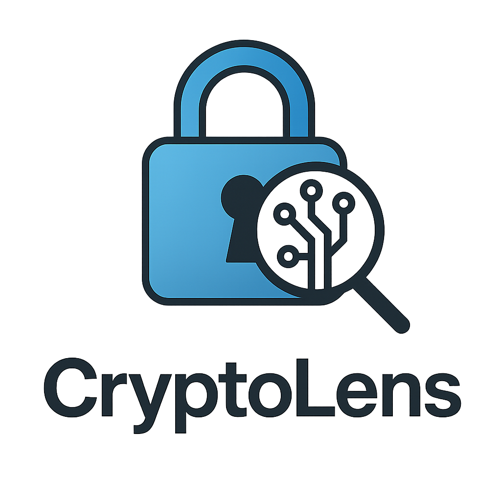
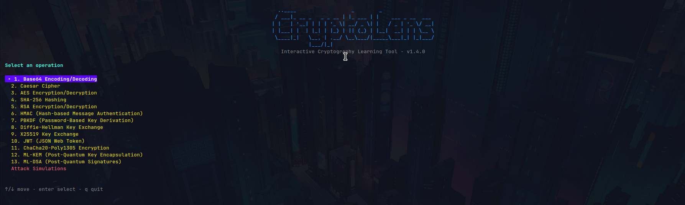

# CryptoLens 🔐

[](https://golang.org)
[](LICENSE)
[](https://goreportcard.com/report/github.com/abdorrahmani/cryptolens)
[](https://pkg.go.dev/github.com/abdorrahmani/cryptolens)
[](CONTRIBUTING.md)
[](https://github.com/abdorrahmani/cryptolens/releases)
[](https://github.com/abdorrahmani/cryptolens/releases)

<div align="center">
  
  <br/>
  <em>Your Interactive Cryptography Learning Tool</em>
</div>

<div align="center">
  
  <br/>
  <em>Interactive Command Line Interface</em>
</div>

## 📖 Overview

CryptoLens is an educational command-line tool that shows you *how* cryptographic
algorithms work, not just what they output. For each operation it prints a
step-by-step visualization — ASCII values, binary representations, intermediate
state, and the final result — so the math and the moving parts stay visible.

It also ships a set of **attack simulations** that demonstrate real-world
cryptographic failures (ECB pattern leakage, nonce reuse, timing side channels,
brute force, and the JWT `none` algorithm bypass) so you can see *why* the
best-practice defenses exist.

> ⚠️ **Educational use only.** CryptoLens is built for learning and
> experimentation. It is not hardened for production key management or
> protecting real secrets.

## 🌟 Highlights

- 🎓 **Learning-first** — every algorithm is explained as it runs
- 🔐 **Broad coverage** — 13 algorithms and protocols, from Base64 to post-quantum ML-KEM/ML-DSA
- 🎯 **Attack simulations** — 5 hands-on demonstrations of cryptographic failures
- 📊 **Built-in benchmarks** — compare HMAC hash functions and PBKDF algorithms
- 🎨 **Readable output** — colored terminal output, ASCII art, and process diagrams
- 📱 **Cross-platform** — prebuilt binaries for Windows, Linux, and macOS (amd64/arm64)

## 📚 Supported Algorithms

Each algorithm has a dedicated write-up in the [`docs/`](./docs) folder with
technical detail, security notes, and troubleshooting.

| # | Algorithm | Category | Docs |
|---|-----------|----------|------|
| 1 | Base64 | Encoding | [base64.md](docs/base64.md) |
| 2 | Caesar Cipher | Classical cipher | [caesar.md](docs/caesar.md) |
| 3 | AES (256-bit) | Symmetric encryption | [aes.md](docs/aes.md) |
| 4 | SHA-256 | Hashing | [sha256.md](docs/sha256.md) |
| 5 | RSA (2048-bit) | Asymmetric encryption | [rsa.md](docs/rsa.md) |
| 6 | HMAC | Message authentication | [hmac.md](docs/hmac.md) |
| 7 | PBKDF | Key derivation | [pbkdf.md](docs/pbkdf.md) |
| 8 | Diffie-Hellman | Key exchange | [dh.md](docs/dh.md) |
| 9 | X25519 | Key exchange | [x25519.md](docs/x25519.md) |
| 10 | JWT | Token signing | [jwt.md](docs/jwt.md) |
| 11 | ChaCha20-Poly1305 | AEAD encryption | [chacha20poly1305.md](docs/chacha20poly1305.md) |
| 12 | ML-KEM (Kyber) | Post-quantum key encapsulation | [mlkem.md](docs/mlkem.md) |
| 13 | ML-DSA (Dilithium) | Post-quantum signatures | [mldsa.md](docs/mldsa.md) |

### Algorithm details

- **Base64** — binary-to-text encoding with ASCII/binary visualization; encode and decode.
- **Caesar Cipher** — classic substitution cipher with a configurable shift and per-character transformation.
- **AES-256** — symmetric block cipher with managed key/IV handling; encrypt and decrypt.
- **SHA-256** — one-way cryptographic hash with input validation.
- **RSA-2048** — asymmetric encryption with automatic key-pair generation and PEM storage; Base64 output.
- **HMAC** — message authentication over six hash functions:
  - SHA-1 *(legacy — not recommended)*, SHA-256, SHA-512
  - BLAKE2b-256, BLAKE2b-512, BLAKE3
  - Output in both hex and Base64, plus an interactive **benchmark** across all six.
- **PBKDF** — password-based key derivation with three algorithms:
  - PBKDF2, Argon2id, and Scrypt, with configurable work factor / memory / threads / key length, and a cross-algorithm **benchmark**.
- **Diffie-Hellman** — authenticated key exchange with RSA-signed public keys (SHA-256 before signing), signature verification, and AES-GCM over the derived secret — a TLS-style flow that illustrates MITM prevention.
- **X25519** — modern Curve25519 exchange with HKDF derivation, AES-GCM demo, scalar validation, and a TLS 1.3 connection-flow walkthrough.
- **JWT** — token generation and verification across three algorithms: HS256, RS256, and EdDSA (Ed25519).

## 🎯 Attack Simulations

Reachable from the main menu (option 12), these demonstrate what goes wrong when
cryptography is misused:

1. **ECB Mode Vulnerability** — shows how ECB preserves plaintext patterns in the ciphertext.
2. **Nonce Reuse in AEAD** — demonstrates how reusing a nonce with ChaCha20-Poly1305 breaks confidentiality (with an XOR walkthrough).
3. **Timing Attack on HMAC** — illustrates why non-constant-time comparison leaks information, with ETA estimation.
4. **Brute Force on Weak Keys/Passwords** — includes a dictionary attack against weak PBKDF parameters and time estimates by key length.
5. **JWT `none` Algorithm Attack** — forges a valid-looking token without a secret and explains proper algorithm validation. See [jwt_none_attack.md](docs/jwt_none_attack.md).

## 🚀 Installation

### Prerequisites

- Go 1.23 or newer (for building from source)
- Git (for source checkout)

### Prebuilt binaries

Download a release archive for your OS/arch from the
[releases page](https://github.com/abdorrahmani/cryptolens/releases) and place
the binary on your `PATH`.

### Using `go install`

The `main` package lives under `cmd/cryptolens`, so install that path:

```bash
go install github.com/abdorrahmani/cryptolens/cmd/cryptolens@latest
```

### From source

```bash
git clone https://github.com/abdorrahmani/cryptolens.git
cd cryptolens
go build -o cryptolens ./cmd/cryptolens
# optionally move it onto your PATH
mv cryptolens /usr/local/bin/
```

## 💻 Usage

Run the binary:

```bash
cryptolens
```

You'll get an interactive menu:

```
CryptoLens - Cryptographic Operations
=================================
Select an operation:
1. Base64 Encoding/Decoding
2. Caesar Cipher
3. AES Encryption/Decryption
4. SHA-256 Hashing
5. RSA Encryption/Decryption
6. HMAC (Hash-based Message Authentication)
7. PBKDF (Password-Based Key Derivation)
8. Diffie-Hellman Key Exchange
9. X25519 Key Exchange
10. JWT (JSON Web Token)
11. ChaCha20-Poly1305 Encryption
12. ML-KEM (Post-Quantum Key Encapsulation)
13. ML-DSA (Post-Quantum Signatures)
   Attack Simulations
```

Navigate with ↑/↓ and Enter; press q or Esc to quit. Post-quantum algorithms
(12, 13) require Go 1.24+ for `crypto/mlkem` and a recent toolchain for
`crypto/mldsa` (FIPS 203/204).

Pick an operation (1–11), choose encrypt/decrypt where applicable, enter your
text, and CryptoLens prints the full step-by-step process and result. Options
6, 7, and 10 prompt for the specific algorithm variant; HMAC and PBKDF also
offer a benchmark mode.

### Configuration and key storage

- **Config file:** on first run, a default `config.yaml` is created at
  `~/.cryptolens/config.yaml`. Edit it to change key sizes, default algorithms,
  and file names. The [`config/config.yaml`](config/config.yaml) in this repo is
  the reference template.
- **Keys:** generated keys are written to a `keys/` directory **next to the
  CryptoLens executable**, created automatically with `0700` permissions. RSA
  and JWT-RSA keys are stored as PEM files; AES, HMAC, ChaCha20, DH, and X25519
  material is stored as `.bin` files.

### Example output

```
Base64 Encoding Process
=====================
Original Text: Hello
    ↓
ASCII Values: 48 65 6c 6c 6f
    ↓
Binary Representation: 01001000 01100101 01101100 01101100 01101111
    ↓
Base64 Encoded: SGVsbG8=
=================================
```

## 🧪 Benchmarks

CryptoLens includes interactive benchmarks you can run from the CLI:

- **HMAC benchmark** (menu 6 → "Run Benchmark") times SHA-1, SHA-256, SHA-512,
  BLAKE2b-256, BLAKE2b-512, and BLAKE3 over a configurable number of iterations,
  reporting relative speed and memory usage.
- **PBKDF benchmark** (menu 7 → "Run Benchmark on All") compares PBKDF2,
  Argon2id, and Scrypt.

Results are hardware-dependent — run them on your own machine rather than
relying on published figures.

## 📁 Project Structure

```
cryptolens/
├── cmd/
│   └── cryptolens/
│       ├── main.go              # Application entry point
│       └── main_test.go
├── internal/
│   ├── crypto/                  # Cryptographic implementations
│   │   ├── base64.go
│   │   ├── caesar.go
│   │   ├── aes.go
│   │   ├── chacha20poly1305.go
│   │   ├── sha256.go
│   │   ├── rsa.go
│   │   ├── hmac.go
│   │   ├── pbkdf.go
│   │   ├── dh.go
│   │   ├── x25519.go
│   │   ├── jwt.go
│   │   ├── keymanager.go
│   │   ├── factory.go
│   │   ├── interfaces.go
│   │   └── attacks/             # Attack simulations
│   │       ├── ecb.go
│   │       ├── nonce_reuse.go
│   │       ├── timing_attack.go
│   │       ├── brute_force.go
│   │       ├── jwt_none.go
│   │       ├── passwords.go
│   │       └── types.go
│   ├── cli/                     # Interactive CLI (menu, display, input, factory)
│   ├── config/                  # Configuration loading & defaults
│   ├── utils/                   # Theme, terminal, timing & visualizer helpers
│   ├── input/                   # Low-level input parsing
│   └── benchmark/               # HMAC & PBKDF benchmarks
├── docs/                        # Per-algorithm documentation
├── config/
│   └── config.yaml              # Reference configuration template
├── assets/                      # Logo & screenshots
├── CHANGELOG.md
├── CONTRIBUTING.md
├── SECURITY.md
├── LICENSE
└── README.md
```

## 🔧 Development

```bash
git clone https://github.com/abdorrahmani/cryptolens.git
cd cryptolens

go mod download        # fetch dependencies
go build ./...         # build everything
go test ./...          # run the test suite
```

### Adding a new algorithm

1. Implement the `crypto.Processor` interface in `internal/crypto/`.
2. Register a creator function in `internal/cli/factory.go`.
3. Add the menu entry in `internal/cli/display.go` and wire it in `internal/cli/menu.go`.
4. Add tests and a doc page under `docs/`.
5. Extend `config/config.yaml` and `internal/config/config.go` if the algorithm needs settings.

## 🤝 Contributing

Contributions are welcome — see the [Contributing Guide](CONTRIBUTING.md) and
[Code of Conduct](CODE_OF_CONDUCT.md). Please write tests, keep documentation in
sync, and follow standard Go conventions.

## 🔒 Security

For security-relevant reports, see [SECURITY.md](SECURITY.md). Remember that
CryptoLens is a learning tool: do not use it to protect production secrets.

## 📝 License

Licensed under the MIT License — see [LICENSE](LICENSE) for details.

## 🙏 Acknowledgments

- The Go standard library crypto packages
- [`golang.org/x/crypto`](https://pkg.go.dev/golang.org/x/crypto) for Argon2, Scrypt, ChaCha20-Poly1305, and X25519
- [`github.com/zeebo/blake3`](https://github.com/zeebo/blake3) and the BLAKE3 team
- [`github.com/golang-jwt/jwt`](https://github.com/golang-jwt/jwt) for JWT support
- Everyone who has contributed to the project

## 📫 Contact

- GitHub: [@abdorrahmani](https://github.com/abdorrahmani)
- Project: [github.com/abdorrahmani/cryptolens](https://github.com/abdorrahmani/cryptolens)
```